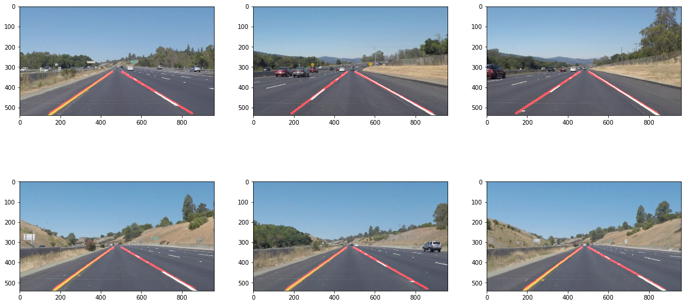

# **Finding Lane Lines on the Road**

# Writeup

## Introduction

This is the first project of the Self Driving Car engineer nanodegree from Udacity.
The task: using openCV and basic Python operations, create an image analysis pipeline
that when given a (daytime) image of the road, accurately identifies lane lines --
both white and yellow, dashed and solid.

## Reflection

### Overview

The high level steps of the pipeline are as follows:
- Convert the image to grayscale
- Use a mild gaussian blurring to make line detection easier
- Mask out uninteresting regions of the image (sky)
- Apply Canny edge detection using experimentally determined thresholds
- Take the edges and convert them into Hough space

At this point in the pipeline, most of the work has been parameter tweaking using existing
libraries. It's been a great learning experience, as both Canny edge detection
and Hough space were new to me going into this project. We've created an image
that has lines (often 20+) highlighted in our region of interest, and now it's time to
use the `draw_lines()` function to intelligentally paint the actual lane lines.
A skeleton of this function was provided to me, and I modified it heavily.

- Cycle through the highlighted lines, and discard any that are under a slope threshold (aka
flat lines). Lane lines while driving tend to be going away (up) from the viewer,
so we can use that to our advantage and get rid of some noise here. Take the
remaining lines and sort them into two categories: positive slope and negative slope.
This nicely sorts the left lane line from the right line. Now, we can perform
operations on both sets to determine where each lane line is.
- Each line is represented as a pair of `(X, Y)` coordinates. When separated by
negative and positive slope, the slopes are all relatively the same -- meaning
they all line approximately on the lane line. Because of this, I can identify
the highest and lowest point in the image, and discard all the in between points.
While this creates the possibility for error (what if the top point happened
to be 20% off?), thankfully this has been largely taken care of upstream.
Tuning the edge detection and creating a strict region of interest has reduced
errors to the point that I can trust there are going to be minimal errors.
- Now that the two extreme points have been identified, I can compute the slope
between the two. Using the slope, I can extrapolate the line to the bottom of the
image, and up towards the center. Due to a fixed camera angle, the extrapolation
can be relatively hardcoded.

The result:

### Video

For a video demonstration, click below!

### Shortcomings

Besides sample images, sample videos were also provided to test on. This was
exciting, as it provides a vastly greater data set. Several shortcomings were
identified throughout the process of creating the analyzer, most of which were
fixed. For instance, originally dashed lines were not detected in the video,
but they were being detected in the pictures. It took several iterations
of parameter tweaking to find a more effective set of parameters that could
detect the dashed lines during the video as well.

One shortcoming that remains is difficulty picking up a yellow lane line when
there is direct sunlight. As the color of the lane line gets closer and closer
to the color of the road, the edge detection algorithm falters, and the
detection becomes weaker. On the same note, shadows also create a lower gradient
overall, so edge detection again falters. Making use of the HSV color space
instead of leaning so heavily on RGB might improve results.

### Improvement

Converting the image into HSV or HSL color space instead of RGB might be an
effective way to more accurately detect lane lines when there is harsh sunlight.
I had good results using HSV color space in my traffic light classifier.

Of course, another improvement would be using a CNN, which might provide excellent
results (but that introduced other drawbacks -- need for data and computation
power, for starters.)
